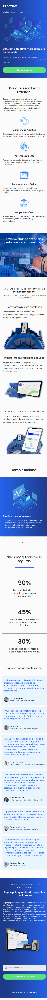

<br/>

<h5 align="center">
  
</h5>

<br/>

<h3 align="center">
  Desafio Tractian - Edu Souza o/
</h3>

<blockquote align="center">“Nunca desista. A vitória pode estar mais próxima do que se imagina!”</blockquote>

<h4 align="center">
  Repositório - Tractian processo seletivo
</h4>

<br/>

<p align="center">
  <a href="https://github.com/EduSouza-programmer"    target="_blank">
    
  </a>&nbsp;
  <a href="https://edusouza-programmer.github.io/" target="_blank">
    
  </a>&nbsp;
  <a href="https://opensource.org/licenses/MIT" >
    
  </a>
</p>

<p align="center">
  <a href="#rocket-Sobre-o-desafio">Sobre o Desafio</a>&nbsp; &nbsp; |&nbsp; &nbsp; 
  <a href="#-Tecnologias">Tecnologias</a>&nbsp; &nbsp; |&nbsp; &nbsp; 
  <a href="#postbox-Entrega">Entrega</a>&nbsp; &nbsp; |&nbsp; &nbsp; 
  <a href="#unlock-Licença">Licença</a>
</p>

<br/>

## :rocket: Sobre o desafio

#### Tractian

A TRACTIAN foi fundada em 2019 por Igor e Gabriel, que viram a vida inteira seus pais, coordenadores de manutenção, saindo de madrugada para resolver problemas nas fábricas. Ambos desde cedo trabalharam em indústrias, onde aprenderam a programar, até que criaram a primeira versão do sensor e da plataforma de monitoramento de máquinas que existe hoje.

A proposta é que todos os profissionais de manutenção tenham acesso ao monitoramento online de equipamentos, e a uma plataforma “braço direito” que analisa, fornece insights valiosos, otimiza rotinas e permite tomada de decisões de forma prática e eficaz.

Tive a oportunidade de participar do processo seletivo onde o `Desafio Web Developer TRACTIAN Maio/21` era construir uma landing page da página inicial da Tractian, inspirado no seu site atual e no site da Cobli.co. Utilizando Next.JS ou React puro (obrigatório). E não esquecendo é claro, o site precisa ser todo responsivo. :muscle:


#### Screenshots / Gif's:

<details>
<summary>GIF's </summary>
<br/>
<p align=center>Suporte para 320px ~ 1920px</p>
<p align=center >
   &nbsp; &nbsp;
</p>

<br/>

<p align=center>Animações de entradas</p>
  <p align=center >
     &nbsp;  
     &nbsp;
     &nbsp; &nbsp;
     
  
  </p>

  <br/>

  <p align=center>Page overview</p>
  <p align=center >
     &nbsp; &nbsp; 
     &nbsp; &nbsp;
  </p>
</details>

<br/>
<br/>

<p align=center >
   &nbsp; &nbsp;
  
</p>

<br/>
<br/>

##  Tecnologias

Esse projeto foi desenvolvido com as seguintes tecnologias:

<table >
  <tr>
    <td align=center><a href="https://nextjs.org/"><div>NextJs</div></a></td>
    <td align=center><a href="https://pt-br.reactjs.org/"><div>React</div></a></td>
    <td align=center><a href="https://nodejs.org/en/"><div>NodeJs</div></a> </td>
    <td align=center><a href="https://www.typescriptlang.org/"><div>Typescript</div></a></td>
    <td align=center><a href="https://styled-components.com/"><div>S.Comp</div></a></td>
    <td align=center><a href="https://storybook.js.org/"><div>Storybook</div></a></td>
    <td align=center><a href="https://jestjs.io/pt-BR/"><div>&nbsp;Jest&nbsp; </div></a></td>
    <td align=center><a href="https://testing-library.com/"><div>T.library</div></a></td>
    <td align=center><a href="https://eslint.org/"><div>Eslint</div></a></td>
    <td align=center><a href="https://prettier.io/"><div>Prettier</div></a></td>
  </tr>
</table>

<br/>

## :postbox: Entrega

Para executar o projeto basta seguir os passos abaixo.
#### Run :eyes:


1. Clone o repositório e abra a pasta dele:

```shell
$ git clone https://github.com/EduSouza-programmer/challenge_tractian-Edu_Souza 
```

2. Instale as dependência com `yarn` ou `npm`:

```shell
$ yarn install
```

3. Depois de clonar e instalar o repositório, rode o projeto em `localhost`:

```shell
$ yarn dev
```

<br/>

E só pra não esquecer srsrs, todo o projeto foi feito com storybook! :smile: 
Para executar, depois que concluir os passos acima, siga com: 

```shell
$ yarn storybook
```

<br/>

#### Concluído :clipboard: 

Foi enriquecedor esse desafio, fiquei impressionado com a proposta da Tractian, sou também técnico eletrista e migrei de profissão a dois anos atrás, mas confesso que fiquei curioso com a tecnologia. Espero muito poder fazer parte da equipe. Mais uma vez, obrigado pela oportunidade! Abaixo o link para o deploy :tada:. 

Acesse o deploy do projeto [aqui](https://challenge-tractian-edu-souza-deploy.vercel.app/).

#### Revisão :beers:

Para documentação utilizei storybook, para os testes, jest com coverage lcov-report, metodologia ágil, kanban.
Acesse o deploy do storybook [aqui](https://edu-tractian-storybook.netlify.app/?path=/story/page-landingpage--mobile). 

<br/>

## :unlock: Licença

Este projeto está licenciado sob a Licença MIT - consulte [LICENSE](https://opensource.org/licenses/MIT) para maiores detalhes.
 
